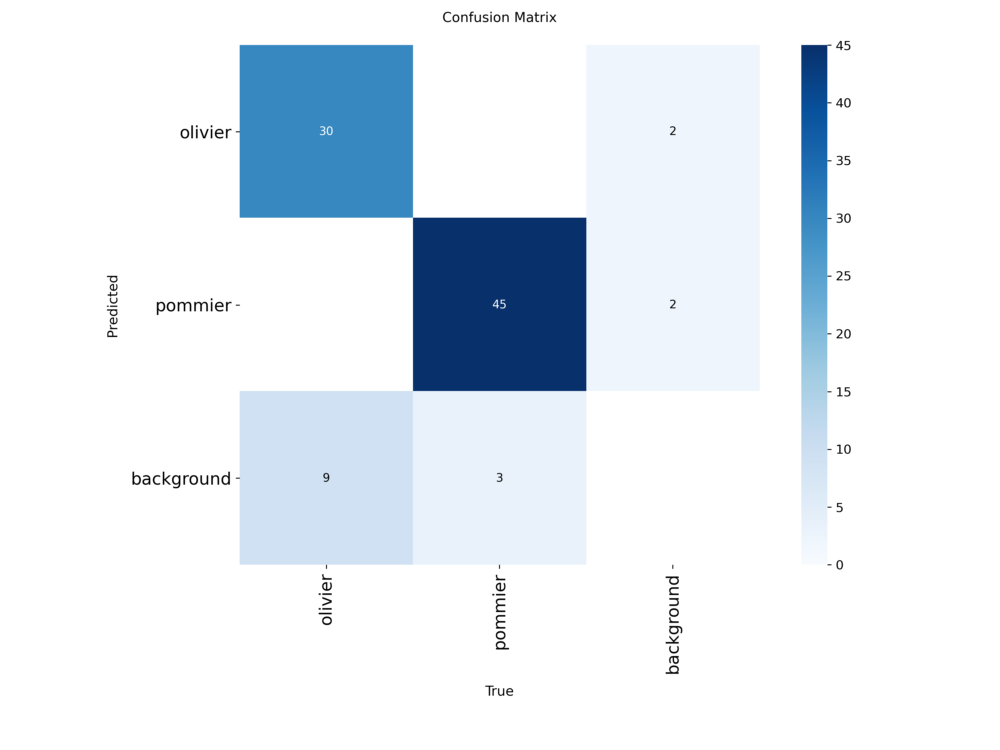
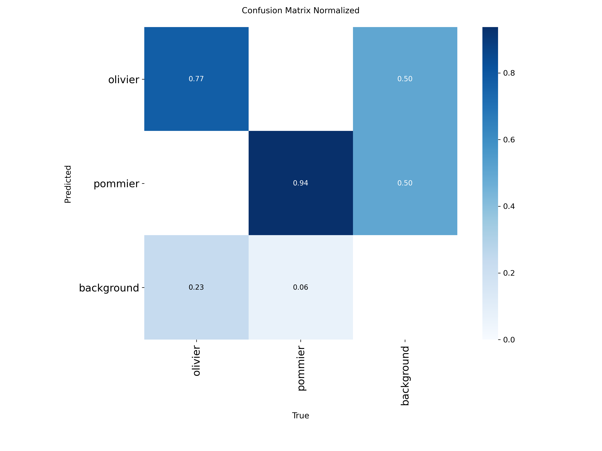
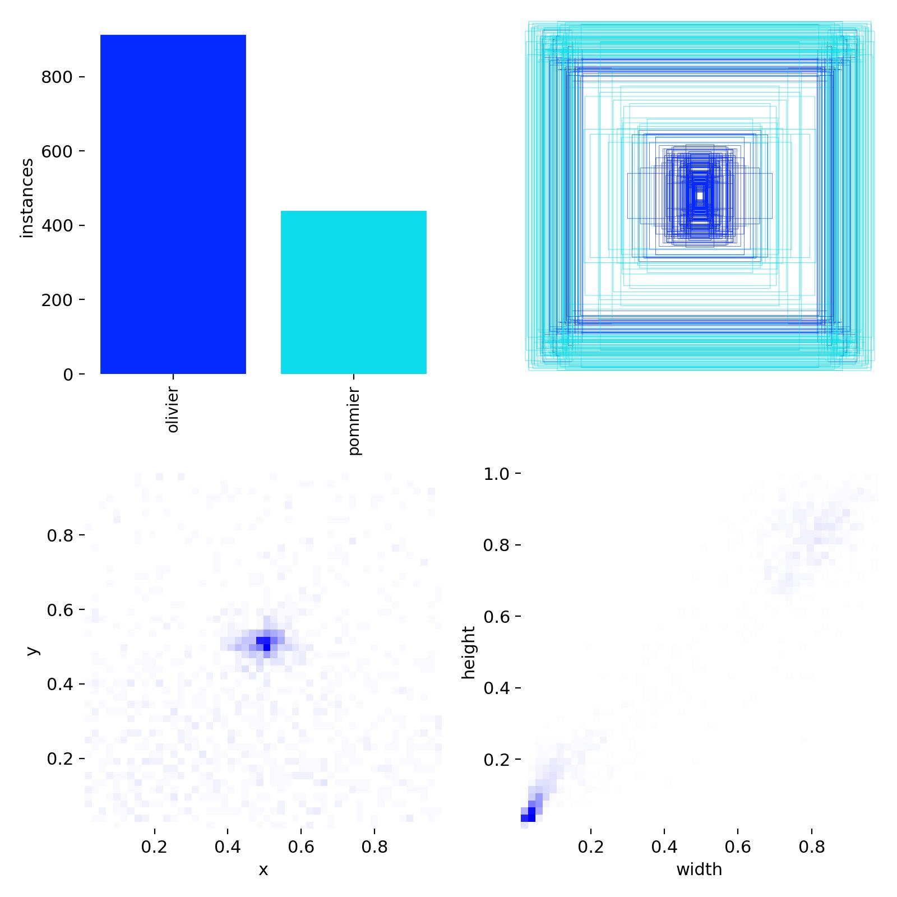

# 🌳 YOLOv8 Tree Classifier: Olivier & Pommier Detection

This project uses a YOLOv8 model to detect **olivier (olive trees)** and **pommier (apple trees)**. The model is trained on a custom dataset of 800 images and produces accurate detection results. Training was performed using Google Colab.

---

## 🖼️ Key Results

### 📈 Training Performance


### 🔍 Confusion Matrix

- **Raw**  
  

- **Normalized**  
  

### 📊 Precision-Recall Curve


### 🏷️ Label Distribution



---

## 🧪 Training Workflow

1. **Dataset Creation**
   - Collected **800 images** of olive and apple trees.
   - Combined into one folder.
   - Annotated using **Label Studio** with two classes: `olivier`, `pommier`.

2. **Model Training**
   - Uploaded dataset ZIP to Google Drive.
   - Trained model using **YOLOv8** in **Google Colab**.

3. **Output**
   - Final model weights: `olv_pom.pt`
   - Training result images (above)
   - Folder `weights/` contains `best.pt` and `last.pt`

---

## 📁 Project Structure

```bash
📁 runs/train/exp
├── 📁 weights/
│   ├── best.pt
│   └── last.pt
├── BoxPR_curve.png
├── confusion_matrix.png
├── confusion_matrix_normalized.png
├── results.png
├── labels.jpg
olv_pom.pt
